# 🧠 MentalHealthOS

> **Ecossistema modular de inteligência clínica para saúde mental** — orquestrado por agentes LLM, com pipelines de processamento, interfaces nativas (macOS + CLI) e runtime multi-modelo.

O **MentalHealthOS** (HealthOS) integra modelos de linguagem (Claude, Codex), fluxos de processamento clínico e interfaces nativas em uma plataforma única, projetada para oferecer a profissionais e pacientes um ambiente seguro e auditável para transcrições, análises linguísticas, revisões clínicas e acompanhamento longitudinal.

---

## 📑 Índice

- [Ecossistema](#-ecossistema-mindmap)
- [Arquitetura do Sistema](#-arquitetura-do-sistema)
- [Pacotes Swift (SwiftPM)](#-estrutura-de-pacotes-swift-swiftpm)
- [Catálogo de Agentes](#-catálogo-de-agentes)
- [Workflow Multiagente](#-workflow-multiagente)
- [Roteamento de Intenções](#-roteamento-de-intenções)
- [Pipeline Clínico](#-pipeline-clínico)
- [Estágios do Pipeline](#-estágios-do-pipeline-gantt)
- [LLM Runtime](#-llm-runtime)
- [Chunking Clínico Adaptativo](#-chunking-clínico-adaptativo)
- [Modelagem de Dados](#-modelagem-de-dados)
- [Workspace do Profissional](#-workspace-do-profissional)
- [Workspace do Paciente](#-workspace-do-paciente)
- [Fluxo de Estado no macOS](#-fluxo-de-estado-no-macos-swiftui)
- [Ciclo de Vida de uma Sessão](#-ciclo-de-vida-de-uma-sessão)
- [Telemetria e Eventos](#-telemetria-e-eventos)
- [Segurança e Privacidade](#-segurança-e-privacidade)
- [Como Executar](#-como-executar)
- [Roadmap](#-roadmap)

---

## 🗺️ Ecossistema (Mindmap)

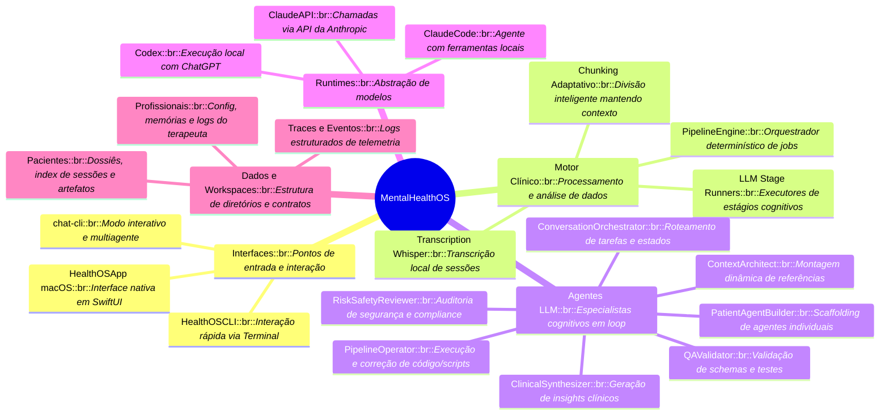

---

## 🏗️ Arquitetura do Sistema

Arquitetura híbrida e modular: pacotes Swift nativos para UI e orquestração base, runtimes TypeScript/Node.js para agentes e processamento, integração com LLMs via providers intercambiáveis.

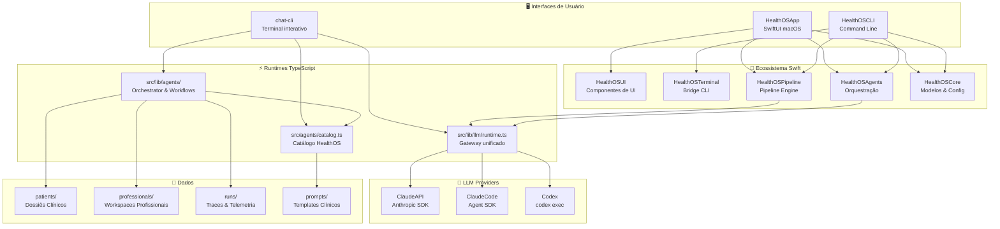

---

## 📦 Estrutura de Pacotes Swift (SwiftPM)

Separação de responsabilidades no backend Swift através de pacotes modulares:

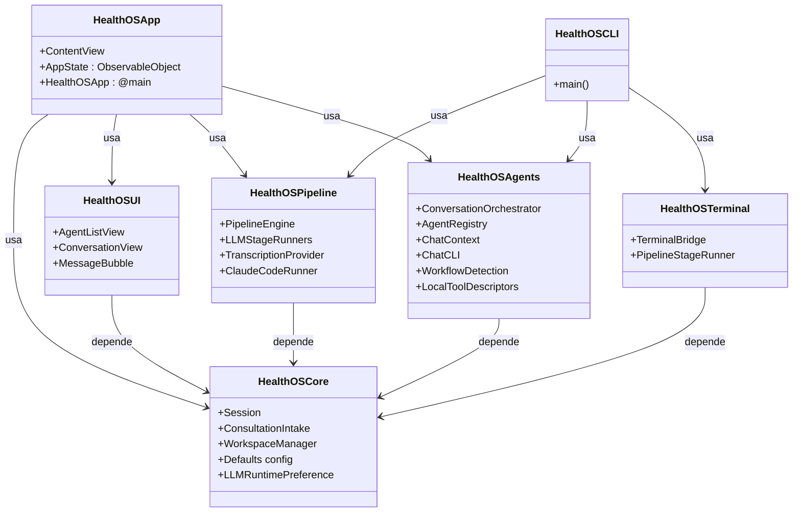

---

## 🤖 Catálogo de Agentes

Agentes HealthOS versionados em `src/agents/catalog.ts`, organizados por categoria e disponibilidade:

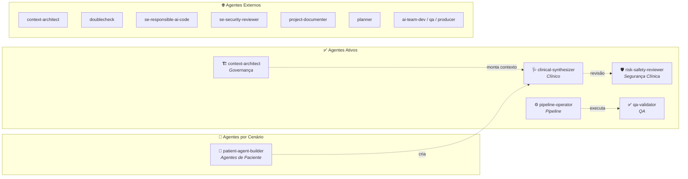

---

## 🔄 Workflow Multiagente

O `ConversationOrchestrator` é o coração da comunicação. Recebe intenções, roteia para agentes especializados, garante revisão de segurança e grava telemetria.

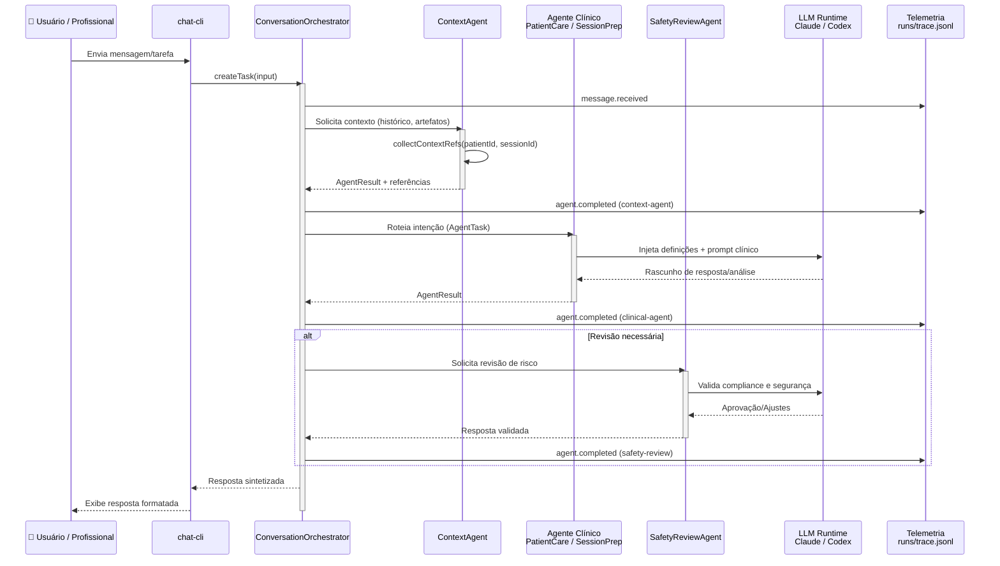

---

## 🧭 Roteamento de Intenções

O `routeIntentToAgent()` analisa a entrada do usuário e direciona para o agente apropriado:

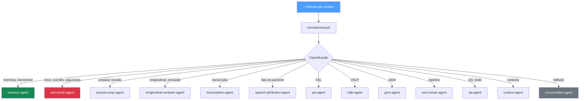

---

## ⚙️ Pipeline Clínico

O módulo `HealthOSPipeline` controla a ingestão e transformação de dados clínicos:

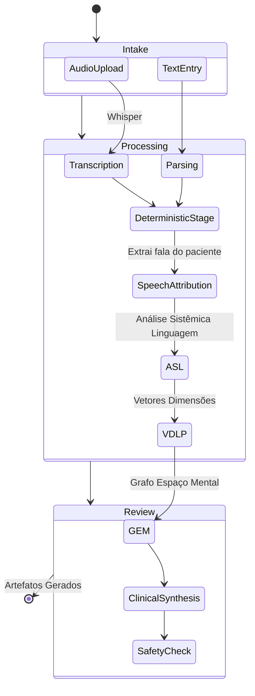

---

## 📅 Estágios do Pipeline (Gantt)

Paralelismo e sequenciamento de um fluxo de pipeline completo:

```mermaid
gantt
    title Pipeline Clínica — Fluxo de Execução
    dateFormat  HH:mm
    axisFormat  %H:%M

    section 🎤 Ingestão
    Upload de Áudio              :a1, 00:00, 2m
    Transcrição (Whisper)        :a2, after a1, 5m

    section 📝 Processamento
    Extração Determinística      :b1, after a2, 1m
    Fala do Paciente (speech)    :b2, after b1, 2m

    section 🧠 Análise LLM
    ASL — Análise Sistêmica      :c1, after b2, 4m
    VDLP — Vetores/Dimensões     :c2, after c1, 4m
    GEM — Grafo Espaço Mental    :c3, after c2, 5m

    section ✅ Validação
    Síntese Clínica              :d1, after c3, 2m
    Safety Review                :d2, after d1, 1m
    Geração de Artefatos         :d3, after d2, 1m
```

---

## 🔌 LLM Runtime

O sistema unifica três providers LLM através de `src/lib/llm/runtime.ts`:

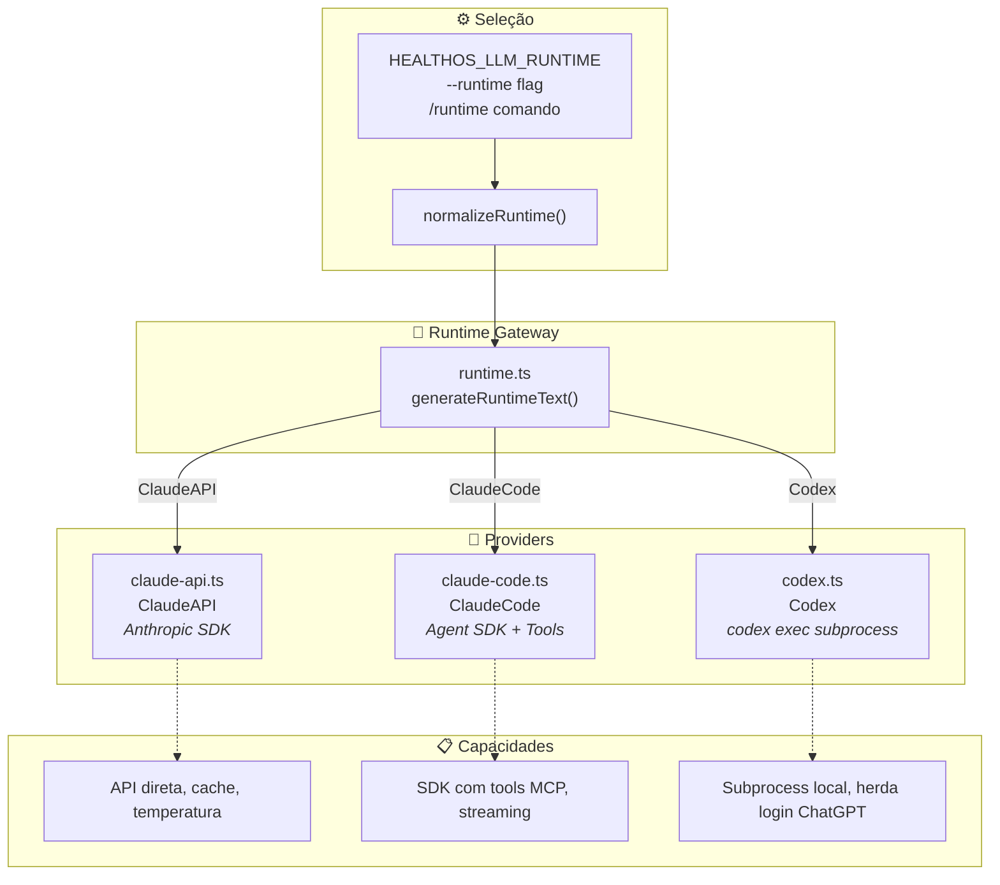

---

## 📐 Chunking Clínico Adaptativo

O sistema de chunking em `src/lib/llm/chunking.ts` prepara entradas para LLMs preservando contexto clínico:

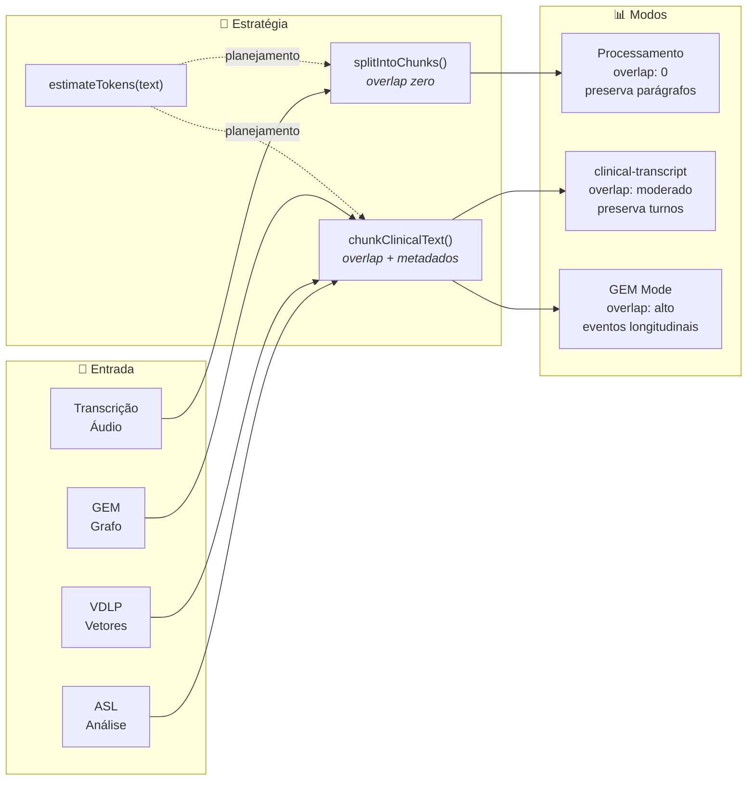

---

## 🗄️ Modelagem de Dados

Modelos principais mantidos pelo `HealthOSCore`, usados em todos os workspaces:

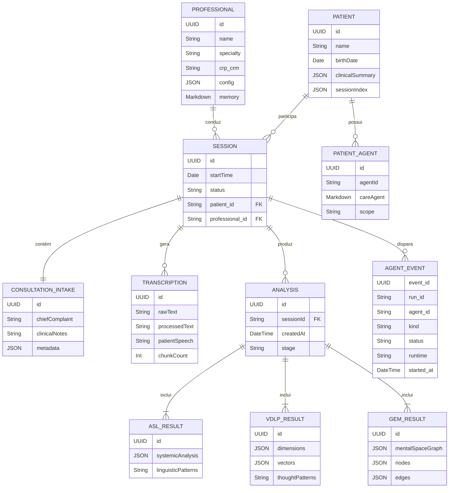

---

## 👨‍⚕️ Workspace do Profissional

Cada profissional tem um workspace isolado em `professionals/<id>/`:

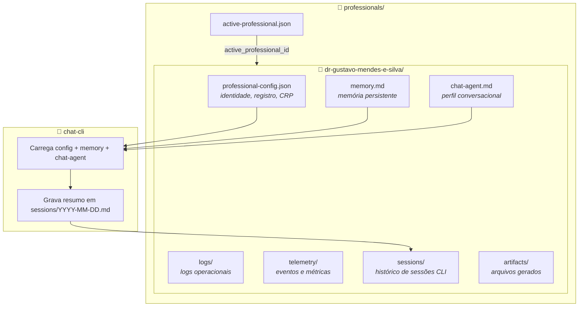

---

## 👤 Workspace do Paciente

Dossiês clínicos organizados em `patients/<PAT_ID>/`:

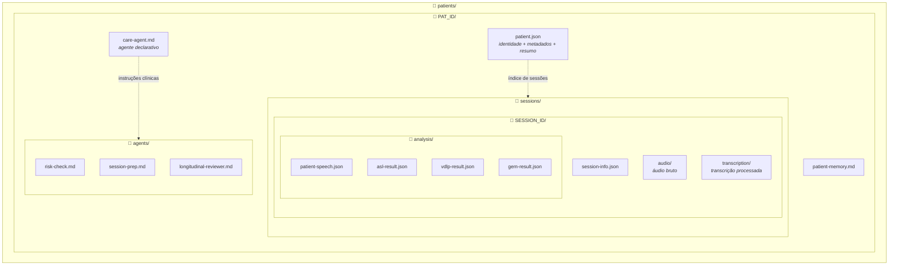

---

## 🔄 Fluxo de Estado no macOS (SwiftUI)

Como as Views do aplicativo macOS conversam com o estado reativo:

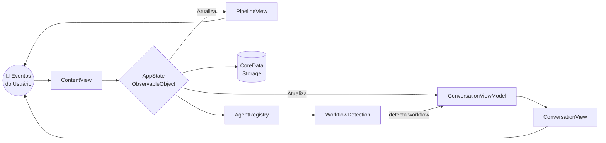

---

## 🔁 Ciclo de Vida de uma Sessão

Fluxo completo desde o upload de áudio até a análise final:

```mermaid
stateDiagram-v2
    [*] --> Created : Nova sessão criada

    state Created {
        [*] --> ConfigLoaded : Carrega profissional ativo
        ConfigLoaded --> PatientSelected : Seleciona paciente
    }

    Created --> Recording : Inicia gravação/upload

    state Recording {
        [*] --> AudioCapture
        AudioCapture --> AudioSaved : Salva em sessions/audio/
    }

    Recording --> Transcribing : npm run transcribe

    state Transcribing {
        [*] --> WhisperProcessing
        WhisperProcessing --> RawTranscript
        RawTranscript --> ProcessedTranscript : pipeline:process
    }

    Transcribing --> Analyzing : Pipeline de Análise

    state Analyzing {
        [*] --> SpeechExtraction : pipeline:speech
        SpeechExtraction --> ASLAnalysis : pipeline:asl
        ASLAnalysis --> VDLPAnalysis : pipeline:vdlp
        VDLPAnalysis --> GEMGeneration : pipeline:gem
    }

    Analyzing --> Reviewed : SafetyReview

    state Reviewed {
        [*] --> ClinicalSynthesis
        ClinicalSynthesis --> SafetyValidated
    }

    Reviewed --> Completed : Artefatos gravados
    Completed --> [*]
```

---

## 📊 Telemetria e Eventos

O sistema de telemetria grava todos os eventos de execução dos agentes:

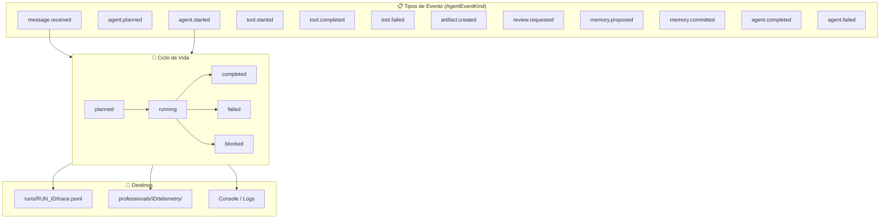

---

## 🛡️ Segurança e Privacidade

O HealthOS foi arquitetado com foco em segurança clínica e proteção de dados:

```mermaid
flowchart TB
    subgraph Camadas ["🔒 Camadas de Segurança"]
        direction TB
        C1["🛡️ SafetyReviewAgent<br/><i>Revisa toda resposta clínica sensível</i>"]
        C2["🔐 Memória Bloqueada por Padrão<br/><i>Somente /remember grava memória</i>"]
        C3["🏥 LGPD Compliance<br/><i>Dados minimizados por design</i>"]
        C4["🔑 Runtimes Locais<br/><i>Controle fino sobre contexto ingerido</i>"]
        C5["📋 Telemetria Auditável<br/><i>Trace append-only por run</i>"]
    end

    subgraph Revisao ["🔍 Fluxo de Revisão"]
        R1["Resposta do Agente"] --> R2{"Envolve<br/>risco clínico?"}
        R2 -->|"Sim"| R3["SafetyReviewAgent"]
        R3 --> R4["Valida:<br/>• Overclaim<br/>• Evidência<br/>• Privacidade<br/>• Conduta"]
        R4 --> R5["Resposta Ajustada"]
        R2 -->|"Não"| R6["Resposta Direta"]
    end

    subgraph MemPolicy ["💾 Política de Memória"]
        M1["Pedido conversacional"] --> M2{"Tipo"}
        M2 -->|"/remember texto"| M3["✅ Grava memória"]
        M2 -->|"inferência implícita"| M4["❌ Proposta/Confirmação"]
    end
```

---

## 🚀 Como Executar

### Pré-requisitos
- macOS 14+ (Sonoma ou superior)
- Xcode 16+ ou Swift 6 Toolchain
- Node.js 20+ (para dependências em `src/` e `chat-cli`)

### Instalação

```bash
# 1. Clone o repositório
git clone <repo-url>
cd mentalhealthos

# 2. Instale as dependências Node
npm install

# 3. Configure o profissional
npm run pipeline:config

# 4. Para o chat-cli interativo
npm run chat-cli

# 5. Para o menu principal
npm run menu
```

### Aplicação Nativa (Swift)

```bash
# Rodar a aplicação macOS
swift run HealthOSApp
# Ou abra o diretório no Xcode

# Rodar a CLI Swift
swift run HealthOSCLI
```

### Pipeline Clínico

```bash
# Transcrever áudio
npm run transcribe

# Processar transcrição
npm run pipeline:process

# Extrair fala do paciente
npm run pipeline:speech

# Análise Sistêmica da Linguagem
npm run pipeline:asl

# Vetores de Dimensões
npm run pipeline:vdlp

# Grafo Espaço Mental
npm run pipeline:gem
```

---

## 🗺️ Roadmap

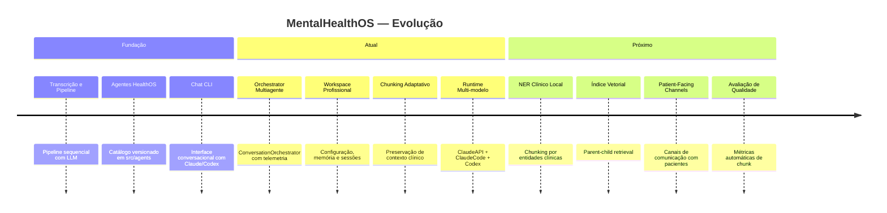

---

## 📄 Licença

Projeto privado — todos os direitos reservados.

**Autor:** Dr. Gustavo Mendes e Silva
